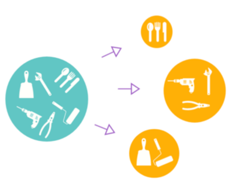
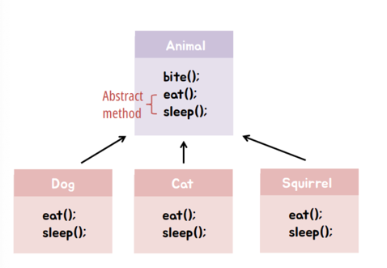
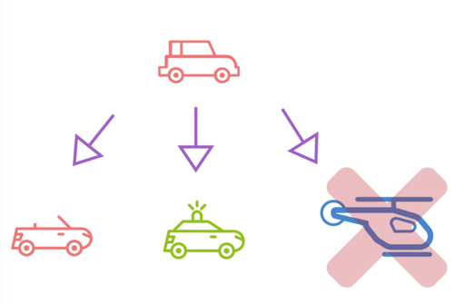

# SOLID 원칙 5가지와 코드에 대한 적용

## 1. SOLID 원칙의 등장과 필요성

## 2. 다섯가지 원칙 소개

* ### SRP (Single Responsibility Principle) - 단일 책임 원칙
    > #### 클래스와 메서드는 하나의 역할만 하도록 한다.
    > #### = 어떤 클래스를 변경해야하는 이유는 오직 하나뿐이어야 한다.
    
    
    이해를 돕는 이미지
    <br>
    </br>
    <예제>

    
    ```

            class Person {
            void cook();     //요리하기 - 요리사
            void order();    //주문하기 - 손님
            void pickup();   //픽업하기 - 손님
            void eat();      //먹기    - 손님
            ...
            }
    
    ```   
    
    Person 클래스는 요리사와 손님의 역할을 모두 가진 클래스이다.
    두 가지의 책임을 가지고 있기 때문에, 요리사의 역할과 관련된 기능이 추가된다면 손님 역할을 가지려고 하는
    클래스는 분명 영향을 받을 것이다.
    
    ```   
    
            class Chef {
            void cook();
            }
            
            class Customer {
            void order();
            void pickup();
            void eat();
            }
    ```

    요리사와 손님이 각 역할을 갖도록 클래스를 분리하였다.
    요리사의 역할과 관련된 기능을 갖도록 Chef 클래스를 변경하여도, Customer 클래스는 영향을 받지 않는다.

    장점 - 클래스 변경으로 인하여 다른 클래스에 주는 영향을 줄일 수 있기 때문에, 응집도를 높이고 결합도가 낮아진다.


* ### OCP (Open-Closed Principle) - 개방 폐쇄 원칙
    > #### 소프트웨어 엔티티(클래스, 모듈, 함수 등)는 확장에 대해서는 열려 있어야 하지만 변경에 대해서는 닫혀 있어야 한다.
    기능 추가가 필요하면 클래스 확장을 통해 손쉽게 구현하면서, 확장에 따른 클래스 수정은 최소화 해야한다.
    *  [ 확장에 열려있다 ] - 새로운 변경 사항이 발생했을 때 유연하게 코드를 추가함으로써 큰 힘을 들이지 않고 애플리케이션의 기능을 확장할 수 있음
    *  [ 변경에 닫혀있다 ] - 새로운 변경 사항이 발생했을 때 객체를 직접적으로 수정을 제한함
  
    

    이해를 돕는 이미지

    말 그대로, OCP 원칙은 추상화 사용을 통한 관계 구축을 권장한다.
    <br>
    </br>
    <예제>

    ```

      interface Car {
      void accel();
      void brake();
      }
    
      class Bus implements Car {
      void accel() { //속도 7 증가 };
      void brake() { //속도 5 감소 };
      }
      
      class Truck implements Car {
      void accel() { //속도 5 증가 };
      void brake() { //속도
    
    ```
    자동차는 bus나 truck 이외에도 다른 자동차 종류를 인터페이스를 통해 확장할 수 있다.

  * ### LSP (Liscov Substitution Principle) - 리스코프 치환 원칙
    >   #### 서브 타입은 언제나 기반(부모) 타입으로 교체할 수 있어야 한다.
    
    

    이해를 돕는 이미지
    <br>
    </br>
    <예제>
  
    ```
  
      public void myData() {
      // Collection 인터페이스 타입으로 변수 선언
      Collection data = new LinkedList();
      data = new HashSet(); // 중간에 전혀 다른 자료형 클래스를 할당해도 호환됨
  
      modify(data); // 메소드 실행
      }
    
      public void modify(Collection data){
      list.add(1); // 인터페이스 구현 구조가 잘 잡혀있기 때문에 add 메소드 동작이 각기 자료형에 맞게 보장됨
      // ...
  
    ```
    자바에선 대표적으로 Collection 인터페이스를 LSP의 예로 들 수 있다고 한다.
    Collection 타입의 객체에서 자료형을 LinkedList 에서 전혀 다른 자료형 HashSet 으로 바꿔도, 
    add() 메서드를 실행하는데 있어 원래 의도대로 작동되기 때문이다. 
    한마디로 다형성 이용을 위해 부모 타입으로 메서드를 실행해도 의도대로 실행되도록 
    구성을 해줘야 하는 원칙이라 이해하면 된다.
    

* ### ISP (Interface Segregation Principle) - 인터페이스 분리 원칙

* ### DIP (Dependency Inversion Principle) - 의존 관계 역전 원칙

## 3. 도서관 시스템에서 SOLID 원칙에 어긋나는 부분
 - 전체 코드


    import java.util.ArrayList;
    import java.util.List;
    
    class Book {
    public String isbn;
    public String title;
    public String author;
    public boolean isBorrowed;
    
        public Book(String isbn, String title, String author) {
            this.isbn = isbn;
            this.title = title;
            this.author = author;
            this.isBorrowed = false;
        }
    }
    
    abstract class User {
    public String userId;
    public String name;
    
        public User(String userId, String name) {
            this.userId = userId;
            this.name = name;
        }
    
        public void borrowBook(Book book) {
            if(!book.isBorrowed) {
                book.isBorrowed = true;
            }
        }
    
        public void returnBook(Book book) {
            if(book.isBorrowed) {
                book.isBorrowed = false;
            }
        }
    
        abstract void addBook(Book book, Library library);
        abstract void removeBook(Book book, Library library); 
    
    }
    
    class Member extends User {
    public Member(String userId, String name) {
    super(userId, name);
    }
    
            public void addBook(Book book, Library library) {
                    System.out.println("Member can't add book");
            }
            public void removeBook(Book book, Library library) {
                    System.out.println("Member can't remove book");
            }
    }
    
    class Manager extends User {
    public Manager(String userId, String name) {
    super(userId, name);
    }
    
            public void addBook(Book book, Library library) {
                    library.addBook(book);
            }
    
            public void removeBook(Book book, Library library) {
                    library.removeBook(book);
            }
    }
    
    
    class Library {
    private List<Book> books = new ArrayList<>();
    private List<User> users = new ArrayList<>();
    
        public Book writeBook(String isbn, String title, String author) {
            Book book = new Book(isbn, title, author);
            books.add(book);
            return book;
        }
            public void addBook(Book book) {
            books.add(book);
        }
    
        public void removeBook(Book book) {
            books.remove(book);
        }
    
        public void addMember(Member member) {
            users.add(member);
        }
    
        public void addManager(Manager manager) {
            users.add(manager);
        }
    }
    
    public class BiodomeFamily08_Before {
    public static void main(String[] args) {
    Library library = new Library();
    
            Book book1 = library.writeBook("0001", "Book1", "Author1");
            Book book2 = library.writeBook("0002", "Book2", "Author2");
    
            Member member = new Member("U001", "Kim");
            Manager manager = new Manager("U002", "Song");
    
            library.addMember(member);
            library.addManager(manager);
    
            member.borrowBook(book1);
            System.out.println("책을 빌립니다: " + book1.title);
            member.returnBook(book1);
            System.out.println("책을 반납합니다: " + book1.title);
        }
    }


코드와 이유
